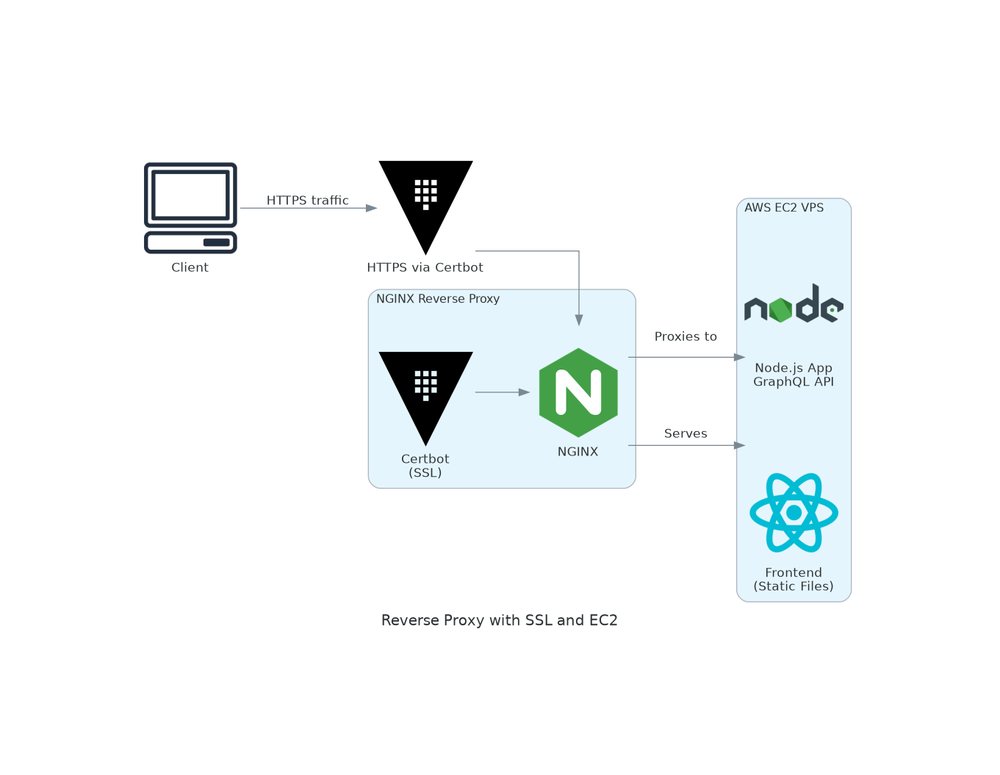

# DevOps Concepts

This project demonstrates the integration of **DevOps practices** in a full-stack application using **GraphQL**, with a strong focus on backend, infrastructure, testing, CI/CD pipelines, and deployment on an **AWS EC2** instance using Docker Compose.

> ⚠️ **Note**: The frontend is minimal; the core focus is backend, CI/CD, infrastructure setup, and automation.

---

## 📦 Tech Stack

### Backend
- **Node.js** with **Apollo Server** for GraphQL API
- **MVC Structure** for clean code organization
- **Prisma ORM** for database management
- **MySQL** as the database
- **Supertest** for API testing

### Frontend
- **Apollo Client** to interact with the GraphQL API
- **Cypress** for end-to-end testing

### DevOps & Infrastructure
- **Docker** & **Docker Compose** for service containerization
- **NGINX** as a reverse proxy
- **Certbot** for generating free SSL certificates
- **GitHub Actions** for CI/CD
- **AWS EC2 (Ubuntu)** VPS with:
  - 2 vCPU cores
  - 1 GB RAM
  - 15 GB SSD

---

## 🧪 Testing

| Area       | Tool       | Description                      |
|------------|------------|----------------------------------|
| API        | Supertest  | Tests GraphQL responses          |
| Frontend   | Cypress    | End-to-end browser testing       |

---

## ⚙️ GitHub Actions Workflows

CI/CD is managed via the following workflows in `.github/workflows/`:

- `backend.yml` – Runs tests for the backend (e.g., using Supertest + Jest)
- `frontend.yml` – Runs Cypress tests
- `deploy.yml` – Builds and deploys all containers to the EC2 server

---


---

## 🚀 Deployment Instructions

### 1. Create EC2 Instance

Provision an **Ubuntu EC2** instance via AWS with:
- Docker and Docker Compose installed
- Open ports **22 (SSH)**, **80 (HTTP)**, and **443 (HTTPS)** in your security group

### 2. Connect via SSH

Use the following command to SSH into your instance:

```bash
   ssh -i /path/to/your/private-key.pem ubuntu@your-ec2-ip-address
   ```
4. **Run Docker Compose** to launch all services:
   ```bash
    docker-compose up --build -d
## 🔐 after add ssl certificates to your server working on https 
   ```bash
   docker run --rm \
  -v $(pwd)/certbot/www:/var/www/certbot \
  -v $(pwd)/certbot/conf:/etc/letsencrypt \
  certbot/certbot certonly \
  --webroot -w /var/www/certbot \
  --email your@email.com \
  --agree-tos \
  --no-eff-email \
  -d yourdomain.com -d www.yourdomain.com
 ```

   

  
